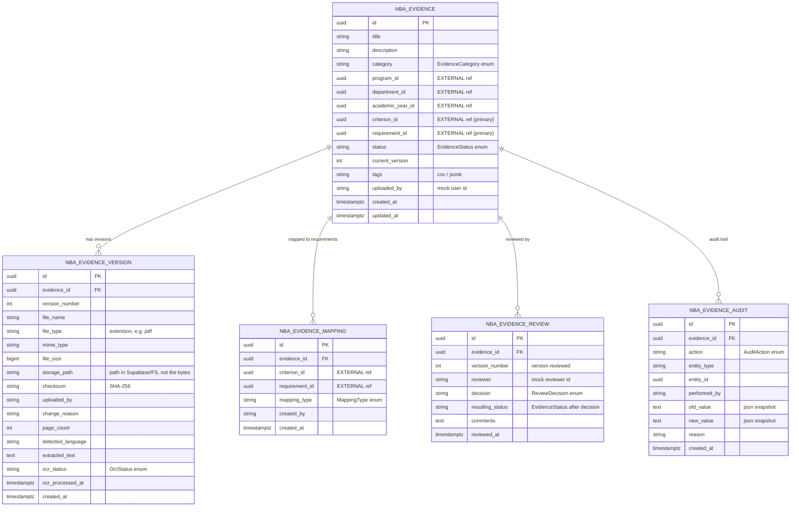
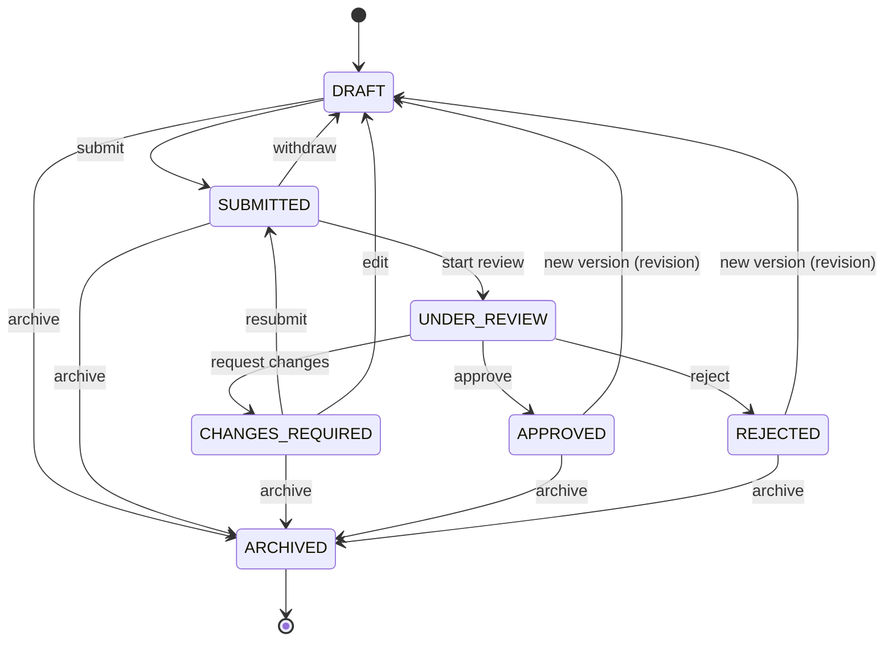

# NBA Evidence Management — Module Design

> Owner: Evidence Management developer (1 of 12).
> This module manages the **complete lifecycle of NBA accreditation evidence**.
> It integrates with other modules **by ID only** and never re-creates their tables.

---

## 1. Architecture

Clean, layered architecture. HTTP concerns live in controllers, business rules in
services, persistence in repositories/entities. Infrastructure concerns (storage,
validation, extraction, OCR, events, audit) are isolated behind interfaces so they can
be swapped without touching business logic.

```
                          ┌───────────────────────────────────────────────┐
   Next.js Frontend  ───▶ │  REST API  /api/v1/evidences                    │
   (TanStack Query)       │  @RestController  (HTTP only, DTO in/out)       │
                          └───────────────┬───────────────────────────────┘
                                          │ DTO
                          ┌───────────────▼───────────────────────────────┐
                          │  Service layer  (@Service, @Transactional)      │
                          │  • EvidenceService      • WorkflowService       │
                          │  • VersionService       • MappingService        │
                          │  • ReviewService        • SearchService         │
                          │  • GapService           • StatisticsService     │
                          │  • ReportService        • AuditService          │
                          └───┬──────────┬──────────┬──────────┬───────────┘
                              │          │          │          │
              ┌───────────────▼──┐  ┌────▼─────┐  ┌─▼────────┐ ┌▼───────────────┐
              │ Repository (JPA) │  │ Storage  │  │Validation│ │ Extraction/OCR │
              │ + Specifications │  │abstraction│ │ (Tika)   │ │ (Tika/PDFBox/  │
              └────────┬─────────┘  └────┬─────┘  └──────────┘ │  Tesseract)    │
                       │                 │                     └────────────────┘
                ┌──────▼──────┐   ┌──────▼───────────┐
                │ PostgreSQL  │   │ Supabase Storage │   (binary files live here,
                │ (metadata)  │   │  / Local FS      │    never in PostgreSQL)
                └─────────────┘   └──────────────────┘

     Cross-cutting: Domain Events (Spring ApplicationEvent, Kafka-ready) ─▶ Audit + Notification hooks
                    Hibernate Envers (field-level history) + custom nba_evidence_audit (business events)
                    Redis (optional cache for statistics) — app works without it
                    Spring AI / pgvector extension points (semantic search, suggestions) — optional
```

### Backend package layout (`com.accreditation.nba.evidence`)

```
evidence/
├── config/          # Async, OpenAPI, Jackson, Web (CORS), Cache, Storage props
├── controller/      # REST controllers (HTTP only)
├── service/         # Business interfaces + impl/ package
├── repository/      # Spring Data repositories
│   └── specification/ # JPA Specifications for dynamic search/filter
├── entity/          # JPA entities (owned tables only)
├── enums/           # EvidenceCategory, EvidenceStatus, MappingType, ReviewDecision, AuditAction, OcrStatus
├── dto/             # request/ and response/ DTOs (+ PageResponse)
├── mapper/          # Entity <-> DTO (hand-written)
├── storage/         # EvidenceStorageService abstraction + Supabase/Local impls
├── validation/      # FileValidationService (Tika, checksum, sanitization)
├── extraction/      # DocumentExtractionService (Tika + PDFBox)
├── ocr/             # OcrService (@Async, Tesseract) — never blocks upload
├── workflow/        # EvidenceWorkflow state machine (valid transitions only)
├── event/           # Domain events + publisher abstraction (Kafka-ready) + listeners
├── audit/           # EvidenceAuditService (custom business audit)
├── report/          # Completion + Status reports (POI Excel / PDFBox PDF)
├── search/          # SearchService (Specifications now, FTS/pgvector-ready)
├── gap/             # GapService + EvidenceRequirementProvider integration point
├── statistics/      # StatisticsService (Redis-cacheable)
├── ai/              # AiEvidenceService extension point (no-op default)
├── integration/     # External module client interfaces + mock impls + CurrentUserProvider
└── exception/       # Domain exceptions + @RestControllerAdvice
```

### Technology mapping

| Concern            | Choice                                                        |
|--------------------|---------------------------------------------------------------|
| Language / runtime | Java 21, Spring Boot 3.3.x                                    |
| Web / API          | Spring Web, springdoc-openapi (Swagger UI)                   |
| Persistence        | Spring Data JPA, Hibernate, Hibernate Envers                 |
| Database           | PostgreSQL (shared project DB; only `nba_evidence_*` tables) |
| Migrations         | Flyway (`flyway-core` + `flyway-database-postgresql`)        |
| File storage       | Supabase Storage (default) / Local FS (dev/test) via abstraction |
| Validation         | Apache Tika (MIME), SHA-256 checksum, filename sanitization  |
| Extraction / OCR   | Apache Tika + PDFBox; Tesseract (Tess4J) async               |
| Events             | Spring `ApplicationEventPublisher` (Kafka-ready abstraction) |
| Cache              | Redis (optional; statistics only)                            |
| Reports            | Apache POI (Excel) + PDFBox (PDF)                            |
| AI (future)        | Spring AI + pgvector extension points (no-op default)        |
| Tests              | JUnit 5, Mockito, Testcontainers (PostgreSQL)                |

**Security note for this phase:** no JWT / login / RBAC. A `CurrentUserProvider` returns a
mock identity (reads optional `X-User-Id` / `X-User-Name` headers, else `mock-user`). This
is the single seam where real authentication is later introduced.

---

## 2. Owned data model (ER)

This module owns exactly five tables. All IDs are `UUID`. External references
(`program_id`, `department_id`, `academic_year_id`, `criterion_id`, `requirement_id`) are
plain FK-ready UUID columns — **no foreign keys to other modules' tables**.



### Relationships & rules
- One **evidence** → many **versions**. The physical file is stored **once per version**;
  replacing a file **always** creates a new version (never overwrite).
- One **evidence** → many **mappings**. A single evidence item can satisfy multiple
  criteria/requirements. The file is stored once; only mappings multiply.
  Unique constraint on `(evidence_id, criterion_id, requirement_id)`.
- One **evidence** → many **reviews** (history of approve/reject/request-changes).
- One **evidence** → many **audit** rows (business events). Envers adds `_aud` history
  tables automatically for field-level tracking.

---

## 3. Evidence lifecycle (state machine)

Invalid transitions are rejected in the service layer (`EvidenceWorkflow`).



Transition table (source → allowed targets):

| From             | Allowed targets                                  |
|------------------|--------------------------------------------------|
| DRAFT            | SUBMITTED, ARCHIVED                              |
| SUBMITTED        | UNDER_REVIEW, DRAFT, ARCHIVED                    |
| UNDER_REVIEW     | APPROVED, REJECTED, CHANGES_REQUIRED             |
| CHANGES_REQUIRED | SUBMITTED, DRAFT, ARCHIVED                       |
| APPROVED         | ARCHIVED, DRAFT (revision via new version)       |
| REJECTED         | ARCHIVED, DRAFT (revision via new version)       |
| ARCHIVED         | — (terminal)                                     |

Reviewer decisions map to transitions (from `UNDER_REVIEW`):
`APPROVE → APPROVED`, `REJECT → REJECTED`, `REQUEST_CHANGES → CHANGES_REQUIRED`.
Comments are **required** for `REJECT` and `REQUEST_CHANGES`.

---

## 4. Core processing pipeline

```
Requirement (external) ─▶ Create Evidence (DRAFT) ─▶ Upload file (version)
   ─▶ Validate (size, MIME via Tika, extension, empty/corrupt, filename safety, SHA-256)
   ─▶ Store (Supabase/FS via abstraction; path template below)
   ─▶ Extract sync metadata (Tika mime, PDFBox page count/text)
   ─▶ Queue async OCR (Tesseract) if scanned  ──(background)──▶ save extracted text/lang
   ─▶ Map to criteria/requirements
   ─▶ Submit ─▶ Review ─▶ Approve / Reject / Request Changes
   ─▶ New version on change (previous versions retained)
   ─▶ Every step emits a domain event + writes audit
```

Storage path template (file stored once):
```
nba-evidence/{programId}/{academicYearId}/{criterionId}/{evidenceId}/{versionNumber}_{sanitizedFilename}
```

---

## 5. Frontend page structure (Next.js App Router)

```
frontend/src/app/evidence/
├── page.tsx                    # Dashboard (stat cards + charts)
├── list/page.tsx               # Data table (search, sort, filter, paginate)
├── upload/page.tsx             # Drag-and-drop upload (RHF + Zod)
├── gaps/page.tsx               # Missing evidence table
├── reports/page.tsx            # Completion / status reports + export
└── [id]/
    ├── page.tsx                # Details (info, preview, mappings, reviews, versions, audit)
    ├── edit/page.tsx           # Edit metadata
    ├── review/page.tsx         # Split layout: preview | metadata + actions
    └── versions/page.tsx       # Version timeline
```

Shared building blocks: `components/evidence/*` (StatCard, EvidenceTable, EvidenceFilters,
StatusBadge, UploadDropzone, VersionTimeline, MappingList, ReviewPanel), `lib/api`
(typed client for `/api/v1/evidences`), `lib/schemas` (Zod), `hooks/` (TanStack Query),
`types/evidence.ts`.

State/data: **TanStack Query** for server state, **React Hook Form + Zod** for forms,
**shadcn/ui + Tailwind** for UI.

---

## 6. Non-goals (module boundary)

Owned: Evidence, Version, File metadata, Mapping, Review, Status, Audit (evidence-scoped),
Search, Gap data, Statistics.

**Not owned / not implemented here:** Program, Department, Course, CO, PO, PSO,
Curriculum, Assessment, Attainment, NBA Criterion, SAR, Users, Roles, Authentication,
platform-wide Notification module, platform-wide Audit module, Kafka, Camunda, OpenSearch.
These are referenced by ID or via integration interfaces (see `INTEGRATION.md`).
